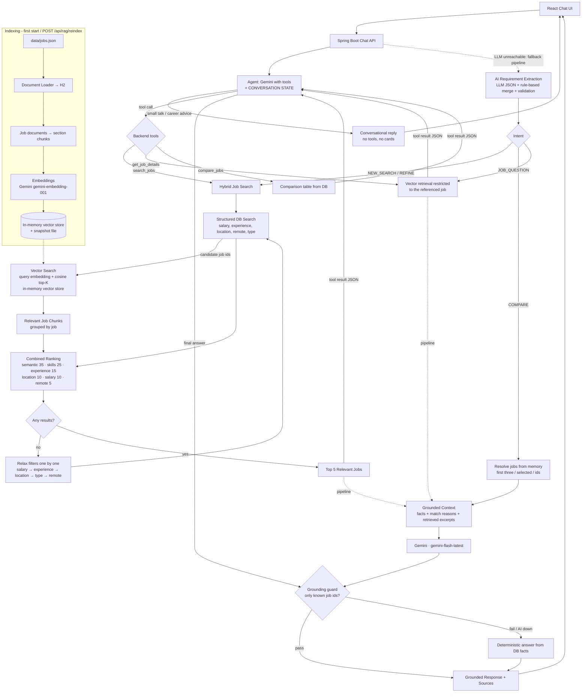

# Job Search Assistant

A chatbot that searches and recommends jobs from a controlled knowledge base using a **real RAG pipeline**:
hybrid structured + vector retrieval, transparent ranking, and grounded answers from
**Google Gemini** (`gemini-flash-latest` through Gemini's OpenAI-compatible API) with `gemini-embedding-001` embeddings.

🎬 **Demo video:** [docs/media/Job-Search-Assistant-Showcase.mp4](docs/media/Job-Search-Assistant-Showcase.mp4) — a 2.5-minute walkthrough of the features and tech stack.

> "I'm a Java developer with 4 years of experience. Find me remote jobs in India with Spring Boot and AWS and salary above ₹10 LPA."

It is a **conversational tool-calling agent** with a ChatGPT-style UI. You chat with it normally: "hi", "how are you" or
"how do I prepare for an interview?" get a normal reply with no job cards. When you ask about jobs, the LLM calls backend
tools and answers **only from what the tools returned**:
- `search_jobs`: hybrid SQL + vector RAG search
- `get_job_details`: the listing plus vector-retrieved excerpts
- `compare_jobs`: side-by-side comparison

If the AI is unavailable it keeps working in deterministic search mode.

> **Demo data.** All 120 jobs in `data/jobs.json` are fictional sample listings (invented companies, `example.com` links).
> They are not real or current vacancies.

---

## Contents

- [What is this?](#what-is-this)
- [Architecture](#architecture)
- [RAG pipeline](#rag-pipeline)
- [How RAG works here, step by step](#how-rag-works-here-step-by-step)
- [Design decisions](#design-decisions)
- [Running the project](#running-the-project)
- [UI features](#ui-features)
- [Configuration](#configuration)
- [REST API](#rest-api)
- [Testing](#testing)
- [Demo script](#demo-script)
- [Known limitations](#known-limitations)
- [Project structure](#project-structure)

---

## What is this?

| Capability | How |
|---|---|
| Conversational agent | Gemini chats naturally and decides when to call the backend tools (`search_jobs`, `get_job_details`, `compare_jobs`). Greetings, small talk and general career questions need no tools. Tool calls appear in the UI as 🔧 chips. |
| Natural-language job search | The LLM extracts `JobSearchCriteria` (skills, location, remote, experience, salary, employment type) as validated JSON. A rule-based parser fills gaps and is the fallback. |
| Hybrid search | SQL filters (salary, experience, location, remote, type) **+** vector similarity over job chunks **→** combined, configurable ranking |
| Real RAG | Jobs → documents → section chunks → embeddings (Gemini `gemini-embedding-001`, 3072-d) → in-memory vector store → query embedding → top-K similarity → grounded prompt |
| Grounded answers | The prompt allows only retrieved context. A **grounding guard** rejects answers that reference jobs not in the context. |
| Source references | Every answer lists the jobs (and chunk sections) it was built from; the UI renders them as clickable chips |
| Conversation memory | `conversation` + `chat_message` tables and sidebar history (search, rename, delete, clear all). Follow-ups work: "only those above ₹15 LPA", "compare the first three", "what skills does this job require?" |
| Comparison | Side-by-side table built from DB facts + LLM-written factual summary |
| Model fallback | A 429 / 503 on the primary model gets one retry, then falls back to `gemini-3.5-flash`, then `gemini-flash-lite-latest` |
| Fallback mode | Missing key or all models down → rule-based extraction, keyword or local-vector retrieval, deterministic answers, UI banner |
| Observability | "RAG Inspector": query → criteria → retrieved chunks + similarity → selected jobs + score breakdown → exact LLM context → answer, timings |

---

## Architecture

One Spring Boot application, one React app. No microservices, no Docker required.

```
React + TypeScript (Vite)  ──/api──►  Spring Boot 3.5 (Java 21)  ──HTTPS──►  Google Gemini (OpenAI-compatible API)
  chat UI, sidebar, cards,            controllers → services → RAG            /chat/completions  (gemini-flash-latest + fallbacks)
  compare, saved jobs, inspector        H2 (jobs, conversations)                /embeddings        (gemini-embedding-001)
                                      In-memory vector store (+ snapshot)
```

The Gemini key exists **only** in the backend (`GEMINI_API_KEY` in a git-ignored `.env` file or the environment).
React never talks to Gemini.

| Package (`backend/src/main/java/com/jobassistant`) | Responsibility |
|---|---|
| `controller` | REST endpoints: `ChatController` (chat, regenerate, conversations, feedback), `JobController` (incl. job cards and saved jobs), `RagController`, `SystemController` |
| `agent` | `AgentService` (LLM tool-calling loop, max 4 rounds, grounding guard), `JobTools` (`search_jobs` / `get_job_details` / `compare_jobs`), `AgentTurn` (per-turn state) |
| `service` | `ChatService` (runs the agent; falls back to the intent-routed pipeline), `JobService`, `ComparisonService`, `FallbackAnswerBuilder` |
| `ai` | `AiService` / `OpenRouterAiService`, `EmbeddingService` / `OpenRouterEmbeddingService` / `LocalHashingEmbeddingService`. The clients speak the OpenAI wire format to any compatible endpoint (Gemini by default); the class names are historical. |
| `rag` | `JobDataLoader`, `JobDocumentBuilder` + `TextChunker`, `IndexingService`, `InMemoryVectorStore`, `Retriever`, `RagService`, `PromptTemplates`, `RagTrace` |
| `search` | `CriteriaExtractionService` (LLM), `RuleBasedCriteriaParser`, `SkillCatalog`, `LocationNormalizer`, `JobSpecifications` (SQL), `RelevanceScorer`, `HybridSearchService` |
| `conversation` | `ConversationService` (memory, follow-up state, titles, list/rename/delete/truncate), `ChatIntent` |
| `entity` / `repository` / `dto` / `mapper` / `config` / `exception` | JPA entities, Spring Data repositories, API records, mapping/formatting, configuration, error handling |

---

## RAG pipeline



## How RAG works here, step by step

1. **Documents are loaded.** `JobDataLoader` reads `data/jobs.json` and upserts every job into the H2 `job` table (the source of truth for filtering and facts).
2. **Documents are chunked.** `JobDocumentBuilder` turns each job into section chunks:
   - `OVERVIEW`: title, company, location, remote, type, experience, salary, description
   - `SKILLS`, `REQUIREMENTS`, `RESPONSIBILITIES`, `BENEFITS`

   Long sections are split on sentence boundaries (`TextChunker`, max 900 chars, 1-sentence overlap). Each chunk starts with a contextual header (`Job: <title> at <company> (<location>)`) and carries metadata `jobId, title, company, location, skills, remote, section`. 120 jobs → 600 chunks.
3. **Embeddings are generated** with Gemini's OpenAI-compatible `POST /v1beta/openai/embeddings` endpoint (model `gemini-embedding-001`, 3072 dimensions, configurable), in batches of 32. On the free tier (~100 embeddings/min) the indexer waits out 429s instead of giving up, using Gemini's "retry in Ns" hint. The first build of 600 chunks therefore takes about 6 minutes.
4. **Embeddings are stored** in the in-memory vector store (`documentId, jobId, chunkText, embedding, metadata`). The store is snapshotted to `backend/db/vector-store.bin`. On restart the snapshot is reloaded if the dataset hash and embedding model are unchanged, so **embeddings are not regenerated on every restart**. `POST /api/rag/reindex` (or `RAG_REINDEX_ON_STARTUP=true`) forces a rebuild.
5. **The user query is embedded** with the same provider/model that built the index (for follow-ups, a standalone rewrite of the query is used).
6. **Similar documents are retrieved**: exact cosine similarity over all chunks of the candidate jobs, top 20 chunks, grouped by job.
7. **Structured filters are applied** first, in SQL (`JobSpecifications`):
   - The job's salary range must reach the requested minimum.
   - Its experience range must overlap the user's.
   - Location must match (unless the user wants remote), and remote/employment type must match.
   - When skills are requested, a job must list at least one of them; free-text topics must appear in the job text.

   Semantic similarity alone never admits a job, because a nearest neighbour always exists, even for a technology no job mentions.
8. **Results are ranked** by `RelevanceScorer`: a weighted average over the components that apply to the query (semantic similarity relative to the best match, skill overlap, experience fit, location, remote, salary). Weights are configurable (`rag.ranking.*`). Every job gets human-readable reasons ("Java and Spring Boot match", "Salary ₹16-22 LPA meets your ₹12 LPA minimum") and gaps.
9. **Relevant context is supplied to the LLM.** It arrives as the JSON result of the `search_jobs` / `get_job_details` tool call (or, in pipeline mode, as a grounded context block). It holds only the top 5 jobs: their DB facts, the engine's match assessment and the best retrieved excerpts. The database is never dumped into the prompt.
10. **The LLM generates a grounded response.** For anything about specific jobs, the system prompt requires answering only from the retrieved tool results and never inventing a job or job details.

### Why this prevents hallucinations

- The **LLM is not the source of truth**. Job cards, salaries, skills, links and the comparison table come straight from the database; the LLM only writes the prose around them.
- The LLM only sees the **retrieved jobs** (tool results), and the prompt forbids using anything else. It must call a tool to get any job fact.
- A **grounding guard** checks every `Job #id` mentioned in the answer. If the model references a job that no tool returned (and that is not in the conversation state), the answer is discarded. A deterministic, fact-based answer is returned instead, visible in the RAG Inspector notes.
- Empty retrieval is answered honestly ("I couldn't find any jobs … matching") **without** calling the LLM, so there is nothing to embellish.
- Relaxed filters and unmet requirements are stated explicitly (gaps), rather than silently returning "close enough" jobs.

---

## Design decisions

| Decision | Choice | Why |
|---|---|---|
| Vector store | **In-memory vector DB** (`InMemoryVectorStore`) behind a `VectorStore` interface, persisted as a binary snapshot | No infrastructure to run (no Docker/pgvector/Qdrant). Search is exact and sub-millisecond at this scale (600 chunks), and the snapshot avoids re-embedding. pgvector/Qdrant can be added by implementing `VectorStore`. |
| Relational DB | **H2 file DB** (`backend/db/`) | Runs anywhere with `mvnw`; JPA Specifications for structured filters; H2 console at `/h2-console`. |
| Chat model | `gemini-flash-latest` via Gemini's OpenAI-compatible endpoint, falling back to `gemini-3.5-flash`, then `gemini-flash-lite-latest` | Fast, supports tool calling, has a free tier; the fallback chain rides out 429/503 "high demand" spikes. `reasoning_effort=low` keeps thinking short. |
| Gemini tool calls | Gemini's `thought_signature` (`extra_content` on each tool call) is kept on `ToolCall` and echoed back | Gemini rejects a follow-up tool turn without it (HTTP 400). |
| Embedding model | `gemini-embedding-001` (3072-d, configurable) | Dedicated embedding model (the chat model is **not** used for embeddings). |
| Offline embeddings | `LocalHashingEmbeddingService` (feature-hashing, 1024-d, synonyms + concept expansion) | Keeps the full RAG pipeline working without a key or when remote embeddings fail. `rag.embedding-provider=auto` uses Gemini when a key is set and falls back automatically. |
| Chat architecture | **Tool-calling agent** (`app.chat.mode=agent`, default) with the intent-routed pipeline as fallback (`pipeline`) | Natural conversation; the LLM decides when retrieval is needed; retrieval stays deterministic and grounded. |
| Extraction | LLM JSON **merged** with a deterministic parser, validated with Jakarta Validation | Robust to model mistakes; complete fallback when the LLM is down. |
| Provider independence | `AiService` / `EmbeddingService` interfaces over the OpenAI wire format | Swap model or provider (Gemini, OpenRouter, …) through configuration. The property prefix is still `openrouter.` for historical reasons. |

---

## Running the project

### Prerequisites

- **JDK 21+** (the Maven wrapper downloads Maven itself). Check with `java -version`.
  If your default `java` is older (e.g. Java 8), point `JAVA_HOME` at a JDK 21 before running the backend,
  for example `C:\Users\<you>\.jdks\corretto-21.0.5`.
- **Node.js 20+** and npm.
- A **Google Gemini API key** (optional: without it the app runs in search-only mode). Create one at <https://aistudio.google.com/apikey>.

### 1. Configure the Gemini key (backend only)

Copy `.env.example` to `.env` in the project root **or** in `backend/` and set your key:

```properties
GEMINI_API_KEY=your-gemini-key-here
```

The backend loads both files automatically at start-up
(`spring.config.import=optional:file:./.env[.properties],optional:file:../.env[.properties]`). A real environment variable
with the same name also works. `.env` files are git-ignored, so never commit real keys.

Optional overrides (same file or environment): `LLM_CHAT_MODEL`, `LLM_FALLBACK_MODELS`, `LLM_EMBEDDING_MODEL`, `LLM_BASE_URL`.
To use OpenRouter instead, set `LLM_BASE_URL=https://openrouter.ai/api/v1`, `OPENROUTER_API_KEY=…` and OpenRouter model ids.

### 2. Start the backend (port 9091)

**Windows (PowerShell)**

```powershell
cd backend
# only if `java -version` is not 21+:
$env:JAVA_HOME = "C:\Users\<you>\.jdks\corretto-21.0.5"
.\mvnw.cmd spring-boot:run
```

**macOS / Linux**

```bash
cd backend
./mvnw spring-boot:run
```

On first start it loads 120 jobs, builds 600 chunks, embeds them and saves `backend/db/vector-store.bin`.
With a free-tier Gemini key this takes **about 6 minutes**: the embedding quota is ~100 texts/min, and the indexer waits
and continues automatically. The API is usable meanwhile, with searches using keyword retrieval until the index is ready.
Later starts reuse the snapshot, so the build happens only once, and again only if the data or the embedding model changes.
Change the port with `SERVER_PORT` if 9091 is taken.

### 3. Start the frontend (port 4000)

```bash
cd frontend
npm install
npm run dev        # or: npm start
```

Open <http://localhost:4000>. Vite proxies `/api` to `http://localhost:9091` (override with `BACKEND_URL`).

### Re-index after changing data or the embedding model

```bash
curl -X POST http://localhost:9091/api/rag/reindex
```

(PowerShell: `Invoke-RestMethod -Method Post http://localhost:9091/api/rag/reindex`)

---

## UI features

- **ChatGPT-style sidebar**
  - Conversations are grouped by date (Today, Yesterday, Previous 7 days, Previous 30 days, Older).
  - The list is searchable, and each chat is titled automatically from its first message.
  - Rename and delete work inline.
  - On desktop the sidebar collapses; on phones it slides over the chat.
- **Message actions**: copy, regenerate the latest answer, edit & resend a previous question, thumbs up / down feedback.
- **Stop generating** while an answer is in progress (Send turns into Stop; `Esc` also stops).
- **Saved jobs**: bookmark jobs from cards or the details drawer; a saved-jobs panel lists them.
- **Restored history**: earlier answers come back with their job cards, not just their text.
- **Export**: download the conversation as Markdown, or copy it.
- **Theme**: light / dark / system, remembered per browser.
- **Settings dialog**: theme, RAG Inspector toggle, clear all conversations, model and index info.
- **Keyboard shortcuts**:

  | Shortcut | Action |
  |---|---|
  | `Ctrl/Cmd + Shift + O` | New chat |
  | `Ctrl/Cmd + K` | Search chats |
  | `/` | Focus the message box |
  | `Ctrl/Cmd + Shift + S` | Toggle the sidebar |
  | `Enter` / `Shift + Enter` | Send / new line |
  | `Esc` | Stop generating |

---

## Configuration

`backend/src/main/resources/application.properties`. The `openrouter.` prefix is historical: it configures whichever
OpenAI-compatible provider `base-url` points at (Gemini by default).

| Property | Env var | Default | Meaning |
|---|---|---|---|
| `openrouter.api-key` | `GEMINI_API_KEY` (or `OPENROUTER_API_KEY`) | empty | LLM key; empty = search-only mode |
| `app.chat.mode` | | `agent` | `agent` (LLM tool calling) or `pipeline` (intent-routed flow) |
| `openrouter.base-url` | `LLM_BASE_URL` | `https://generativelanguage.googleapis.com/v1beta/openai` | OpenAI-compatible API base URL |
| `openrouter.chat-model` | `LLM_CHAT_MODEL` | `gemini-flash-latest` | Primary chat model |
| `openrouter.fallback-chat-models` | `LLM_FALLBACK_MODELS` | `gemini-3.5-flash,gemini-flash-lite-latest` | Tried in order on 429 / 5xx |
| `openrouter.reasoning-effort` | | `low` | Gemini thinking budget (`low` / `medium` / `high`); not sent to OpenRouter |
| `openrouter.embedding-model` | `LLM_EMBEDDING_MODEL` | `gemini-embedding-001` | Embedding model |
| `openrouter.temperature` / `openrouter.max-tokens` | | `0.4` / `3000` | Generation settings |
| `rag.embedding-provider` | `RAG_EMBEDDING_PROVIDER` | `auto` | `auto` / `openrouter` (remote: Gemini or OpenRouter) / `local` |
| `rag.vector-store-file` | | `./db/vector-store.bin` | Snapshot of the in-memory vector store |
| `rag.reindex-on-startup` | `RAG_REINDEX_ON_STARTUP` | `false` | Force a rebuild on start |
| `rag.retrieval-top-k` | | `20` | Chunks retrieved per query |
| `rag.max-jobs-returned` | | `5` | Jobs shown and sent to the LLM |
| `rag.history-window` | | `8` | Messages of history used for query understanding |
| `rag.ranking.*` | | `0.35 / 0.25 / 0.15 / 0.10 / 0.10 / 0.05` | Weights: semantic / skills / experience / location / salary / remote |
| `rag.debug-enabled` | | `true` | Enables RAG traces in responses and `/api/rag/traces` |
| `server.port` | `SERVER_PORT` | `9091` | Backend port |

Set `logging.level.com.jobassistant.rag.RagTraceStore=DEBUG` to log the full trace of every request.

---

## REST API

| Method | Path | Purpose |
|---|---|---|
| `POST` | `/api/chat` | Chat turn. Body: `{conversationId?, message, selectedJobIds?, focusJobId?, filters?, debug?}` → grounded `message`, `jobs`, `sources`, `comparison`, `criteria`, `aiAvailable`, `notice`, `suggestions`, `toolCalls`, `userMessageId`, `assistantMessageId`, `debug` |
| `POST` | `/api/chat/regenerate` | `{conversationId, debug?}` → drops the last answer and its question, then re-answers (same response as `/api/chat`) |
| `GET` | `/api/conversations` | Sidebar list: `[{id, title, createdAt, updatedAt, messageCount}]`, most recent first |
| `PUT` | `/api/conversations/{id}` | Rename: `{title}` → 204 |
| `DELETE` | `/api/conversations/{id}` | Delete one conversation → 204 |
| `DELETE` | `/api/conversations` | Delete all conversations → 204 |
| `POST` | `/api/conversations/{id}/truncate` | `{fromMessageId}` → deletes that message and everything after it (edit & resend) → 204 |
| `GET` | `/api/conversations/{id}/messages` | Conversation history (including `jobIds` and `feedback`) |
| `PUT` | `/api/messages/{id}/feedback` | `{rating: "up" \| "down" \| null}` → 204 |
| `POST` | `/api/jobs/search` | Deterministic hybrid search (no LLM): `{query?, skills?, location?, remote?, experienceMin?, experienceMax?, salaryMin?, employmentType?, limit?}` |
| `GET` | `/api/jobs/{id}` | Job details |
| `POST` | `/api/jobs/cards` | `{jobIds}` → job cards in the requested order (restores cards in history) |
| `POST` | `/api/jobs/compare` | `{jobIds: [2-4 ids]}` → comparison table + summary |
| `GET` | `/api/jobs?page=0&size=20` | Paged job list |
| `GET` / `PUT` / `DELETE` | `/api/saved-jobs`, `/api/saved-jobs/{jobId}` | Saved (bookmarked) jobs |
| `POST` | `/api/rag/reindex` | Rebuild the vector index |
| `GET` | `/api/rag/status` | Index status (provider, model, dimensions, chunk count) |
| `GET` | `/api/rag/retrieve?q=...&topK=10` | Inspect raw vector retrieval (debug) |
| `GET` | `/api/rag/traces?limit=20` | Recent RAG traces (debug) |
| `GET` | `/api/system/status` | AI configured/health, models, index status (never the key) |

Full request/response examples: [`docs/api.md`](docs/api.md). Architecture notes: [`docs/architecture.md`](docs/architecture.md).

---

## Testing

```bash
cd backend
./mvnw test          # Windows: .\mvnw.cmd test
```

All tests run offline (local embeddings, stubbed/mocked LLM):

| Area | Tests |
|---|---|
| RAG | Document building and chunk metadata; long-section splitting; indexing all 120 jobs into 600 chunks; **restart reuses the snapshot without re-embedding**; reindex re-embeds; vector retrieval ordering; pre-filtered and empty retrieval; snapshot round-trip; local embedding properties |
| Search | Skill, salary, experience (incl. "less than 5 years"), remote and location filtering; relaxation; unknown topic → empty; refinement restricted to previous candidates; rule-based parsing |
| Chat | Normal question (grounded answer, cards, sources, only top-K jobs in the prompt); follow-up refinement; compare and job question via memory; empty results; AI failure fallback; missing key; **grounding guard**; friendly small talk when AI is down; invalid requests (400/404/405/415) |
| Agent (`AgentChatTest`) | Small talk and career questions answered without tools or cards; multi-turn "hi" → advice → job search; `search_jobs` runs the real RAG search; refine / compare / details via conversation state; grounding guard; invalid tool arguments reported back to the model; fallback to the pipeline when the model is unavailable |
| LLM clients (`OpenRouterClientsTest`) | Real HTTP against a local stub: chat and embeddings wire format, auth header, error mapping; missing key handled without a call; no OpenRouter-only fields sent to Gemini; Gemini `thought_signature` round-trip; 503 → fallback model |
| Conversations | List / rename / delete, auto-titles, regenerate, truncate, feedback, saved jobs, job cards |
| Security/config | API key never appears in `/api/system/status`, chat debug traces or `/api/rag/*`; unreachable provider degrades gracefully; `toString()` masks the key |

Frontend: `cd frontend && npm run build` (TypeScript strict type-check + production build).

---

## Demo script

Turn on the **RAG Inspector** (in Settings) to show the tool calls and retrieval for each answer. Start with `hi` to show a normal chat reply (no tools, no cards).

| # | Say | What to point out |
|---|---|---|
| 1 | `Find remote Java Spring Boot jobs.` | Extracted criteria (skills + remote), 45 SQL candidates → 20 chunks → 5 jobs, match reasons |
| 2 | `I'm a Java developer with 4 years experience. I want jobs above ₹12 LPA.` | Experience + salary extraction; salary/experience reasons and gaps |
| 3 | `Find React jobs in Bangalore.` | Location filter |
| 4 | `Show me remote jobs requiring AWS.` | Skill gate + remote |
| 5 | `Compare the first three jobs.` | Memory resolves "first three"; table from DB + grounded summary |
| 6 | `Only show jobs with less than 5 years experience.` | REFINE: restricted to previous candidates, merged criteria |
| 7 | `What skills does this job require?` | JOB_QUESTION: vector retrieval inside one job, answer from its chunks |

Also try:
- `Find COBOL mainframe jobs` (honest empty result) and `Show jobs above ₹500 LPA` (filters relaxed and reported)
- `How should I prepare for a system design interview?` (career advice, no tools)
- The 🔧 tool-call chips, **Compare** checkboxes, **Ask about this job**, the clickable `Job #…` source chips, bookmarks, regenerate and edit

---

## Known limitations

- **Demo data only**: 120 fictional jobs, all in India, salaries in INR (no currency conversion).
- **Free-tier rate limits**: Gemini free-tier models have low per-minute quotas (e.g. `gemini-3.8-flash` allows only 5 requests/min) and often return 503 "high demand".
  - An agent turn uses ~2-3 LLM calls + 1 embedding call, so answers can take 3–20 s while retries and fallbacks kick in.
  - Embeddings are limited to ~100 texts/min, which is why the first index build takes ~6 minutes.
  - When every model is unavailable, the app falls back to search-only mode. A paid key makes it faster and more reliable.
- **Brute-force vector search** is ideal for thousands of chunks; for millions, implement `VectorStore` with pgvector/Qdrant/HNSW.
- The **local fallback embedder** is lexical-semantic (hashing + synonyms), not a neural model. Recall for paraphrases is lower than with Gemini embeddings.
- **Semantic score is relative** to the best retrieved job in each query; match percentages are indicators, not objective ratings.
- The grounding guard verifies job references, not every individual sentence; the prompt and DB-sourced cards cover the rest.
- **No authentication**: conversations and saved jobs are shared by everyone using the same backend (fine for local use).
- Changing the embedding model triggers a full re-embed on the next start (by design, since vector spaces are incompatible).

---

## Project structure

```
.
├── README.md
├── .gitignore / .env.example      # copy .env.example to .env and set GEMINI_API_KEY
├── data/
│   ├── jobs.json                 # 120 fictional demo jobs (knowledge base)
│   ├── README.md
│   └── tools/generate-jobs.mjs   # reproducible generator (seeded)
├── docs/
│   ├── architecture.md           # components, data model, flows, scoring
│   └── api.md                    # request/response examples
├── backend/                      # Spring Boot 3.5, Java 21, Maven wrapper
│   ├── pom.xml, mvnw, mvnw.cmd
│   ├── .env                      # GEMINI_API_KEY (git-ignored, not committed)
│   └── src/main/java/com/jobassistant/{controller,service,repository,entity,dto,mapper,config,exception,agent,ai,rag,search,conversation}
└── frontend/                     # React 19 + TypeScript + Vite
    └── src/{components,hooks,api,utils}
```
